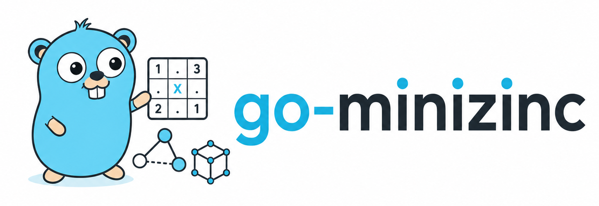

# go-minizinc

<p align="center">
  
</p>

Go bindings for the [MiniZinc](https://www.minizinc.org/) command-line tool.
Build or load a model, provide data for each solve, choose an installed solver,
and decode solutions into Go values.

## Requirements

- Go 1.21 or newer
- MiniZinc 2.6 or newer
- The `minizinc` executable on `PATH`, or an explicit path passed to `NewDriver`

Install MiniZinc from the
[official downloads page](https://www.minizinc.org/software.html), then add the
module:

```bash
go get github.com/Malomalsky/go-minizinc
```

## Quick Start

```go
package main

import (
	"context"
	"fmt"
	"log"
	"time"

	"github.com/Malomalsky/go-minizinc"
)

func main() {
	model := minizinc.NewModel(`
		int: n;
		var 1..n: x;
		solve maximize x;
	`)

	instance, err := minizinc.NewInstanceAuto(model)
	if err != nil {
		log.Fatal(err)
	}

	ctx, cancel := context.WithTimeout(context.Background(), 10*time.Second)
	defer cancel()

	result, err := instance.Solve(ctx,
		minizinc.WithParams(minizinc.Params{"n": 10}),
		minizinc.WithTimeLimit(5*time.Second),
	)
	if err != nil {
		log.Fatal(err)
	}

	var solution struct {
		X int `json:"x"`
	}
	if err := result.Decode(&solution); err != nil {
		log.Fatal(err)
	}

	fmt.Printf("status=%s x=%d\n", result.Status, solution.X)
}
```

`NewInstanceAuto` selects from the solvers reported by the installed MiniZinc
distribution. Use an explicit solver when reproducibility matters.

## Models and Data

Pass MiniZinc source directly to `NewModel`:

```go
model := minizinc.NewModel(
	"int: n;",
	"array[1..n] of var 1..n: x;",
	"solve satisfy;",
)
```

Load an existing model and attach MiniZinc data files:

```go
model, err := minizinc.LoadModel("models/schedule.mzn")
if err != nil {
	log.Fatal(err)
}
if err := model.AddFile("data/instance.dzn"); err != nil {
	log.Fatal(err)
}
```

`AddString` appends source fragments. `AddFile` accepts `.mzn`, `.dzn`, and
`.json` files. Relative includes in a loaded `.mzn` file are resolved from that
file's directory.

Use `WithParams` for values that change between solves:

```go
for _, n := range []int{8, 16, 32} {
	result, err := instance.Solve(ctx,
		minizinc.WithParams(minizinc.Params{"n": n}),
	)
	if err != nil {
		log.Fatal(err)
	}
	fmt.Printf("n=%d solution=%v\n", n, result.Solution)
}
```

Solve-scoped parameters are copied before MiniZinc starts and do not mutate the
instance. They override defaults set with `Model.SetParam` or
`Instance.SetParam` for that call. Parameter values must be JSON-serializable.

Builder-declared parameters are checked before a subprocess starts. Missing
values are returned as `*minizinc.MissingParamsError`.

## Solver Selection

Automatic selection uses the model text and installed solver metadata:

```go
instance, err := minizinc.NewInstanceAuto(model)
if err != nil {
	log.Fatal(err)
}
```

Select a solver by ID, name, or tag when the choice is part of application
behavior:

```go
solver, err := minizinc.FindSolver("gecode")
if err != nil {
	log.Fatal(err)
}
instance, err := minizinc.NewInstance(model, solver)
if err != nil {
	log.Fatal(err)
}
```

Use a non-default MiniZinc executable through a `Driver`:

```go
driver, err := minizinc.NewDriver("/opt/minizinc/bin/minizinc")
if err != nil {
	log.Fatal(err)
}
solver, err := minizinc.FindSolverForModelWithDriver(model, driver)
if err != nil {
	log.Fatal(err)
}
instance, err := minizinc.NewInstance(model, solver)
if err != nil {
	log.Fatal(err)
}
```

`ListSolvers`, `FindBestSolver`, and `FindSolverForModelWithWarnings` expose the
same discovery data for custom selection policies.

## Solving

`Solve` returns the last solution and terminal status:

```go
result, err := instance.Solve(ctx, minizinc.WithParams(minizinc.Params{"n": 10}))
if err != nil {
	log.Fatal(err)
}
```

`SolveAll` collects all reported solutions. Use `WithNumSolutions` to cap the
result count:

```go
results, err := instance.SolveAll(ctx,
	minizinc.WithParams(minizinc.Params{"n": 10}),
	minizinc.WithNumSolutions(20),
)
if err != nil {
	log.Fatal(err)
}
for _, result := range results {
	fmt.Println(result.Solution)
}
```

Enumeration requires solver support for MiniZinc's `-a` flag. Limiting a solve
to more than one result requires `-n` support; unsupported combinations return
an error before the process starts.

`SolveStream` emits solutions as MiniZinc produces them. Stream failures are
returned through `Result.Error`:

```go
for result := range instance.SolveStream(ctx, minizinc.WithParams(minizinc.Params{"n": 10})) {
	if result.Error != nil {
		log.Fatal(result.Error)
	}
	var solution struct {
		X int `json:"x"`
	}
	if err := result.Decode(&solution); err != nil {
		log.Fatal(err)
	}
	fmt.Printf("intermediate=%t x=%d\n", result.IsIntermediate, solution.X)
}
```

Solve calls on one `Instance` are serialized. Create separate instances from
the same model when solves must run in parallel.

## Results and Output

`Result.Decode` is the usual way to read a known solution shape. For dynamic
models, use `Get`, `GetInt`, `GetFloat`, `GetBool`, `GetString`, or `GetArray`.

Native MiniZinc JSON output is enabled by default. `Result.Solution` contains
the decoded variables and `_objective` for optimization models. Models with
custom output sections can also use:

- `Result.Section(name)` for string-valued sections
- `Result.Output` for raw output values
- `Result.SectionOrder` for the order reported by MiniZinc

Select DZN or item output when required by an existing model:

```go
result, err := instance.Solve(ctx, minizinc.WithOutputMode(minizinc.OutputModeDZN))
if err != nil {
	log.Fatal(err)
}
```

Request solver statistics with `WithStatistics`. Common fields are available
on `Result.Statistics`; solver-specific values remain in
`Result.Statistics.Raw`.

## Errors and Cancellation

Process failures are returned as `*minizinc.MinizincError` with the failing
stage, exit code, stderr, and a coarse category:

```go
var processError *minizinc.MinizincError
if errors.As(err, &processError) {
	log.Printf("stage=%s exit=%d stderr=%s", processError.Stage, processError.ExitCode, processError.Stderr)
}

switch {
case errors.Is(err, minizinc.ErrSyntax):
	log.Print("invalid model syntax")
case errors.Is(err, minizinc.ErrType):
	log.Print("invalid model types")
case errors.Is(err, minizinc.ErrRuntime):
	log.Print("solver runtime failure")
}
```

Context cancellation stops the MiniZinc process and returns the context error
from `Solve` and `SolveAll`. `WithTimeLimit` sets MiniZinc's own search limit;
check `Result.HitTimeLimit` because MiniZinc may return a feasible solution
without a terminal status:

```go
result, err := instance.Solve(ctx, minizinc.WithTimeLimit(2*time.Second))
if err != nil {
	log.Fatal(err)
}
if result.HitTimeLimit {
	log.Print("search stopped at the time limit")
}
```

`WithCancelGrace` changes the Unix grace period between termination and forced
kill.

## Builder and Escape Hatches

The optional `Builder` API covers common declarations, expressions,
comprehensions, search annotations, and solve items:

```go
builder := minizinc.NewBuilder()
n := builder.IntParam("n")
x := builder.IntArrayVarSized("x", n, 1, 20)
builder.Constraint(builder.AllDifferent(x))
builder.Satisfy()
model := builder.Build()
```

The generated model remains a normal `Model`, so unsupported syntax can be
added with `AddString`. Lower-level integrations can use `WithExtraArgs`,
`WithSolverOptions`, `WithModelViaStdin`, `WithCommandHook`, and a custom
`Driver`.

## Compatibility

- Go 1.21+ and MiniZinc 2.6+ are supported by the public API and CLI driver.
- Process execution and temporary model/data files are portable across macOS,
  Linux, and Windows; available solvers depend on the MiniZinc installation.
- Each solve launches a MiniZinc process. Reusing an `Instance` avoids API
  setup, but it is not incremental compilation or solver-state reuse.
- JSON values and output details follow the installed MiniZinc version and the
  selected solver.

## Examples

- [`examples/simple`](examples/simple) — explicit solver and one result
- [`examples/nqueens`](examples/nqueens) — model parameters and arrays
- [`examples/streaming`](examples/streaming) — streamed solutions
- [`examples/auto_solver`](examples/auto_solver) — automatic solver selection
- [`examples/builder_nqueens`](examples/builder_nqueens) — Builder DSL

Complete symbol documentation is available through
[`go doc`](https://pkg.go.dev/github.com/Malomalsky/go-minizinc).

## Testing

```bash
go test ./...
go test -race ./...
go vet ./...
```

Tests that require MiniZinc or a particular solver skip when it is unavailable.
